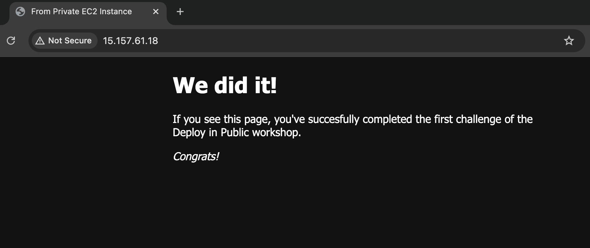

# Week 1 - Deploy applications manually on the AWS console with EC2
## Project Overview
- Setup AWS account
  - Create an AWS root account with one Admin user

- Deploy a simple NGINX app using AWS console
  - Create a VPC with 2 subnets (public, private)
  - Create an Internet gateway to connect the public subnet to the internet (inbound & outbound)
  - Create a NAT gateway to connect the private subnet to the internet (outbound only)
  - Create 2 route tables: 1 public (default within VPC, internet gateway), 1 private (default within VPC, NAT gateway)
  - Launch 3 EC2 Instances: 2 public (bastion host to connect to private, reverse proxy to private using NGINX), 1 private (actual web application using NGINX)
    - Included creation of 3 security groups: bastion host (local ssh), reverse proxy (inbound web traffic, local ssh), private (inbound from reverse proxy, local ssh from bastion)

## Resources
- Commonly used [CIDR blocks](https://docs.aws.amazon.com/vpc/latest/userguide/subnet-sizing.html):
  - `10.0.0.0/24` - 256 IP addresses; VPC's CIDR block, shows up as target: 'local' where used elsewhere
    - `10.0.0.0/25` - 128 IP addresses (`10.0.0.0` - `10.0.0.127`); public subnet's CIDR block
    - `10.0.0.128/25` - 128 IP addresses (`10.0.0.128` - `10.0.0.255`); private subnet's CIDR block
  - `0.0.0.0/0` - all IP addresses; internet gateway's CIDR block

## Final Result
