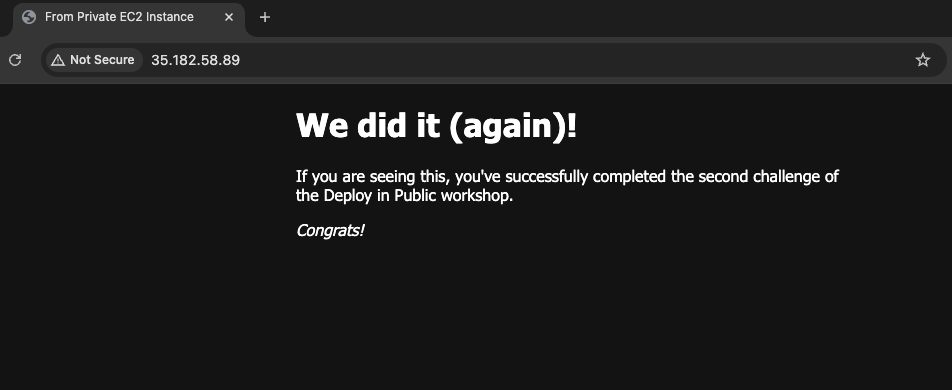

# Week 2 - Provision AWS resources through Terraform
## Project Overview
- Setup AWS account
  - Create an IAM user to get access key to enable AWS CLI

- Deploy a simple NGINX app via using Terraform
  - A repeat of [deployment steps from Week 1](https://github.com/katiestruthers/Deploy-in-Public/tree/main/Week_1#project-overview), only this time using [Terraform](https://developer.hashicorp.com/terraform) / Infrasture as Code (IaC) and the [AWS CLI](https://aws.amazon.com/cli/)

## Resources
- [Terraform Registry](https://registry.terraform.io/)
- Commonly used [Terraform CLI commands](https://developer.hashicorp.com/terraform/cli/commands):
  - `terraform init`: Prepare your working directory for other commands
    - `terraform init -upgrade`: Update locked dependency selections to match a changed configuration
  - `terraform plan`: Show changes required by the current configuration
  - `terraform apply`: Create or update infrastructure
  - `terraform destroy`: Destroy previously-created infrastructure (useful for learning, as you want to avoid unnecessary charges)
- Adding SSH Key to SSH Agent
  - `eval "$(ssh-agent -s)"`
  - `ssh-add dip-key.pem`

## Final Result
