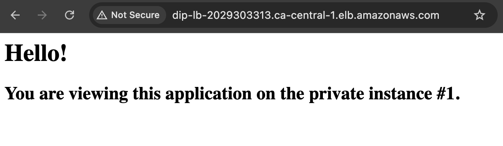

# Week 3 - Multi-availability Zone EC2 Deployment with Load Balancer
## Project Overview
- Expand on Week 2's work
  - Refactor [main.tf](../main.tf) to use modules and variables, starting with the VPC module

- Setup AWS account
  - Create an IAM Role for Systems Manager, so that you can opt for using the [AWS Systems Manager](https://docs.aws.amazon.com/systems-manager/latest/userguide/session-manager.html) over using a bastion host

- Deploy a simple NGINX app using Terraform
  - A repeat of the fundamental [deployment steps from Week 1](https://github.com/katiestruthers/Deploy-in-Public/tree/main/Week_1#project-overview) and Week 2, expanding this time to use a load balancer in two different availability zones in lieu of public EC2 instances

## Resources
- Divide your subnets from 2 to 4: [Subnet Calculator](https://www.davidc.net/sites/default/subnets/subnets.html)
- Walkthrough: [Managing Application Load Balancer (ALB) with Terraform](https://spacelift.io/blog/terraform-alb)
- Start a session from AWS CLI:
  - `aws ssm start-session --target <instance-id>`

## Final Result
