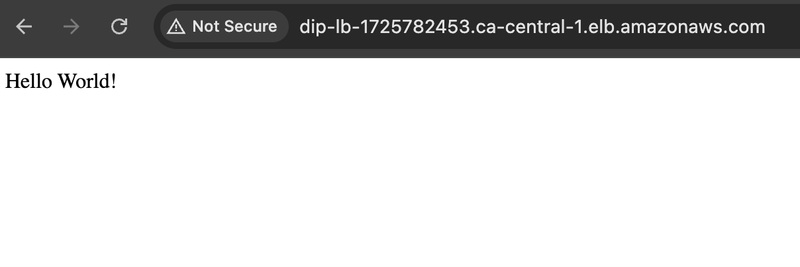

# Week 4 - Simple API Deployment with Docker, Terraform, and AWS EC2
## Project Overview
- Deploy a [simple NestJS API](https://github.com/katiestruthers/Deploy-in-Public-NestJS)

## Resources
- [NestJS Documentation](https://docs.nestjs.com/)
- [Tutorial: Setting Up Node.js on an Amazon EC2 Instance](https://docs.aws.amazon.com/sdk-for-javascript/v2/developer-guide/setting-up-node-on-ec2-instance.html)
- [Dockerizing NestJS Application](https://medium.com/@sujan.dumaru.official/dockerizing-nestjs-application-c4b25139fe4c)

## Final Result
