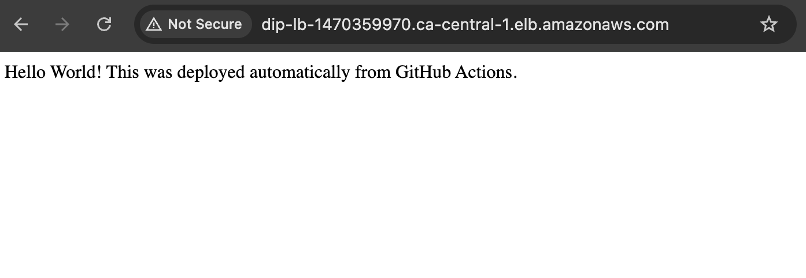

# Week 5 - Simple API Deployment with GitHub Actions
## Project Overview
- Deploy the same containerized [simple NestJS API](https://github.com/katiestruthers/Deploy-in-Public-NestJS) from Week 4, only this time automating the process through CI/CD

- Create our GitHub workflow with two jobs:

1. **Build**
   - Use [AWS ECR Login Actions](https://github.com/aws-actions/amazon-ecr-login) to login 
   - Build and Push Docker Image to ECR

2. **Deploy**
   - Use [AWS ECR Login Actions](https://github.com/aws-actions/amazon-ecr-login) to login 
   - Deploy to EC2

## Resources
- [GitHub Actions docs](https://docs.github.com/en/actions)
- [Build And Push Docker Image to AWS ECR using GitHub Actions](https://medium.com/@anshita.bhasin/build-and-push-docker-image-to-aws-ecr-using-github-actions-506e9f77f7f8)

## Final Result
- The workflow we created is in the NestJS repo: https://github.com/katiestruthers/Deploy-in-Public-NestJS/blob/main/.github/workflows/main.yml

